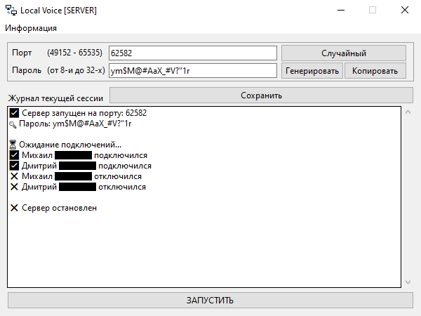

# Local Voice [SERVER]

Бесплатный голосовой чат с открытым исходным кодом, разделенный на серверную и клиентскую части:
1. [**Сервер**](https://github.com/x2DFox/local-voice-server/releases/latest) — разворачивается на отдельном хостинге или на компьютере одного из пользователей в сети и принимает/передает данные, полученные от клиентов.
2. [**Клиент**](https://github.com/x2DFox/local-voice-client/releases/latest) — нужен для подключения пользователя к серверу в локальной сети или через интернет.

> [!WARNING]
> **Обратная совместимость между релизами** возможна, но не гарантируется и не поддерживается. Для корректной работы используйте только последние версии клиента и сервера.

> [!CAUTION]
> **Шифрование не реализовано**. Пароль и аудио передаются в открытом виде независимо от того, локальная это сеть или публичный адрес. Если сервер доступен из интернета — любой сможет подслушать разговор и узнать пароль.



# Системные требования

- 🐍 Python 3.12
- 🖥️ Windows 10
- 🛠️ Linux/MacOS: работоспособность не проверялась

> [!TIP]
> При желании код Local Voice можно адаптировать под более ранние версии Windows и Python — лицензия BSD 3-Clause это позволяет, и такие форки только приветствуются.

# Установка

1. Скачайте последнюю версию [сервера](https://github.com/x2DFox/local-voice-server/releases/latest).
2. Распакуйте архив в удобную папку.
3. Запустите `local-voice-server.exe`.

# Использование

Получите случайные порт и пароль в интерфейсе программы или введите вручную и передайте подключаемым клиентам. Также потребуется сообщить IP-адрес:

- При работе внутри локальной сети — локальный IP компьютера с сервером, например, `192.168.x.x`. `localhost` подойдет только в случае, если клиент запущен на том же компьютере, что и сервер.
- При подключении через интернет с "белым" IP — укажите его. Точный адрес можно узнать на [2IP](https://2ip.io/) или аналогичном сайте.

Local Voice также поддерживает работу через инструменты для построения виртуальной локальной сети через интернет (Hamachi, Radmin, Porthole и т.п.). В этом случае клиентам нужно подключаться к серверу того компьютера, который является администратором текущей виртуальной сети.

# Сборка

Помимо использования уже скомпилированного исполняемого файла, вы можете собрать его вручную командой:

```bash
pyinstaller --clean --noconsole --onedir --name local-voice-server --contents-directory library --icon icon.ico main.py
```

# Лицензия
[BSD 3-Clause](https://github.com/x2DFox/local-voice-server/blob/main/LICENSE)
